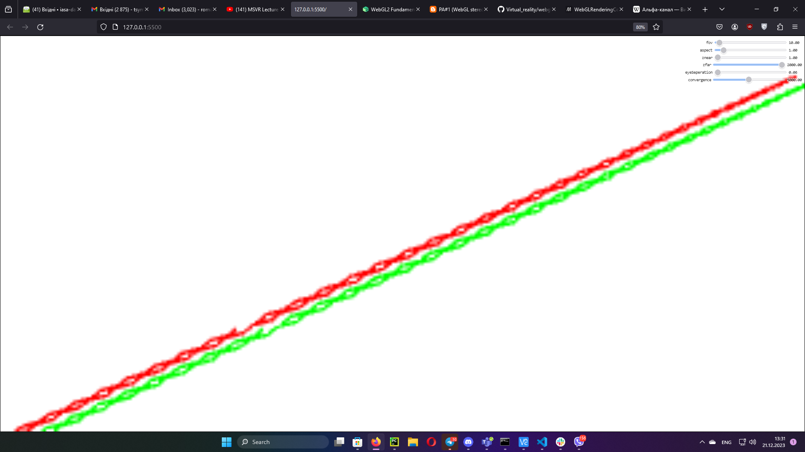
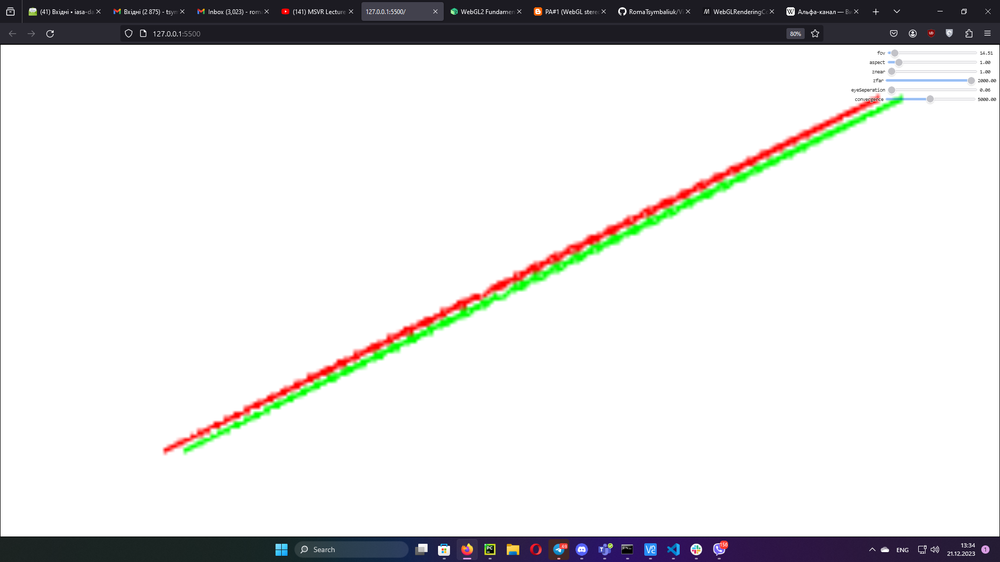
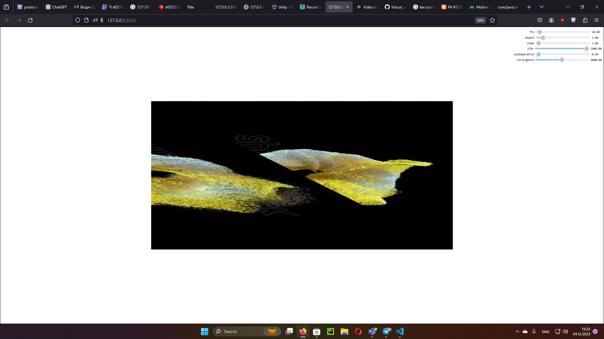
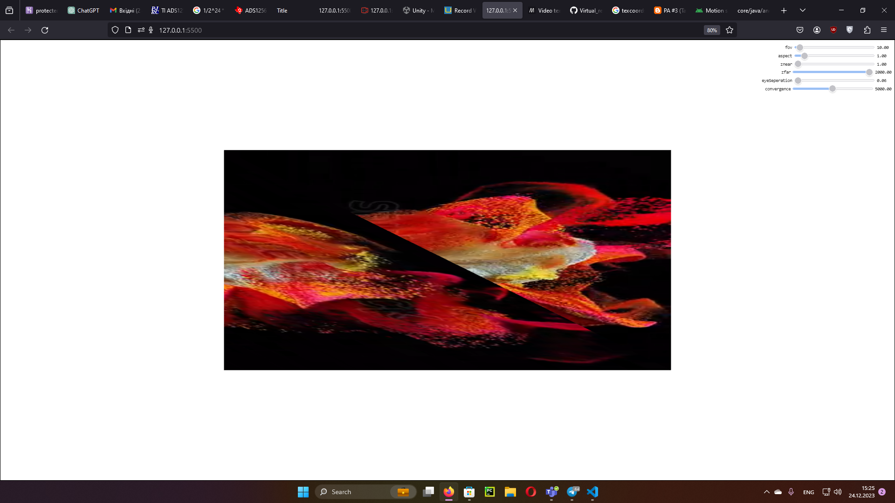
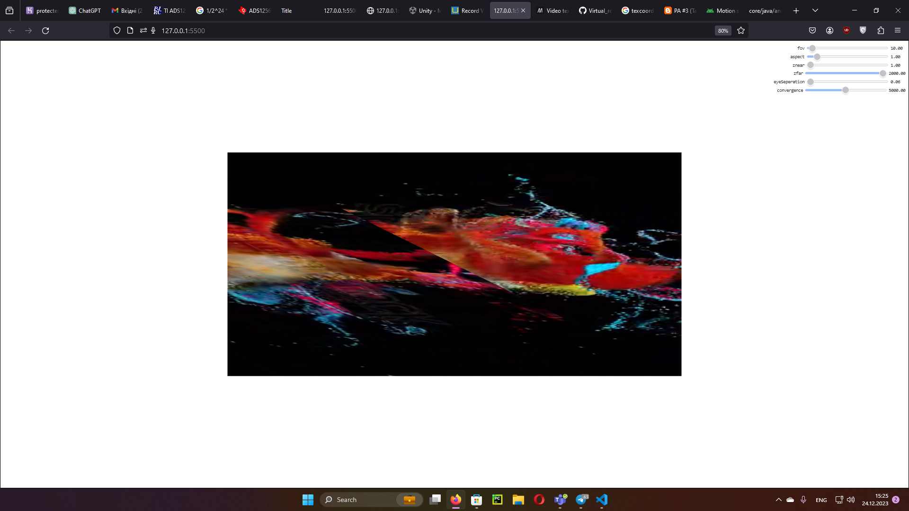
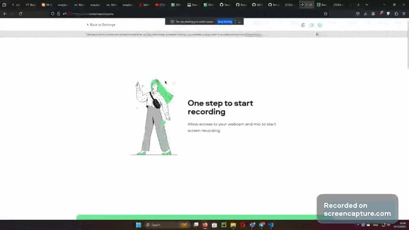

# Lab 2 Virtual Reality

WebGL is used as main library. 
Work examples:
First initial position:

In the right top corner there are parameters that can be changed (FOV, cameraX, cameraY, cameraZ, aspect ratio, znear, zfar, eye_seperation - distance between the eyes, convergence)
For example let's try to change FOV, ratio and znear and apply left and right frustum
Let's try to change some params:
With changed FOV:

Let's add texture video:
Function loadWebCamTexture() setups web cam texture. Because of virtual camera (OBS) on the computer attempt of capturing video from camera by navigator.mediaDevices was unsuccessful.

Was added interval to play video:

From main():   
    setInterval(draw, 1/20);

Another frames from the video:

Gif presenting video in texture:

