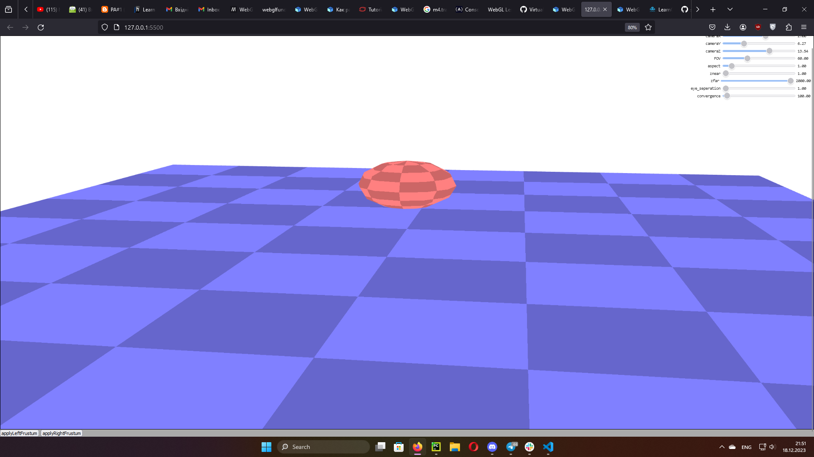
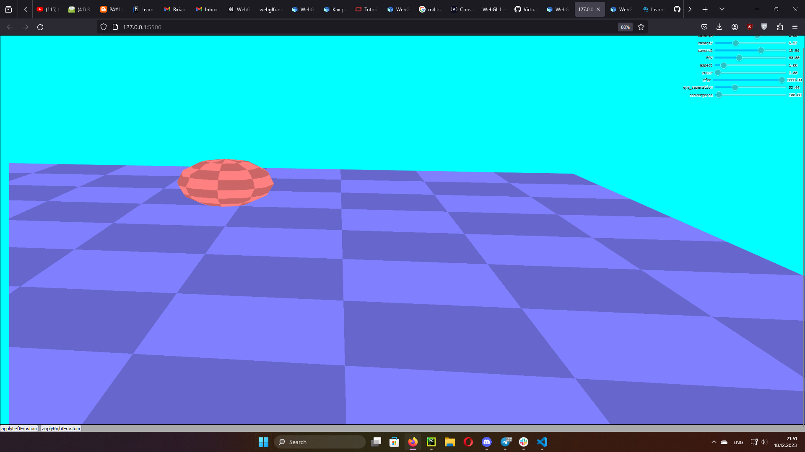

Lab 1 Virtual Reality.
1. WebGL is used as main library. 
2. Function applyLeftFrustum() applies view from the right eye, and function applyRightFrustum() applies view from the left eye.
3. Function drawScene() renderes plane with a sphere on it.
4. applyLeftFrustum() and applyRightFrustum() are called by clicking on the corresponding buttons below the scene.
Work examples:
First initial position:
 
After applying left frustum:

After applying right frustum:

In the right top corner there are parameters that can be changed (FOV, cameraX, cameraY, cameraZ, aspect ratio, znear, zfar, eye_seperation - distance between the eyes, convergence)
