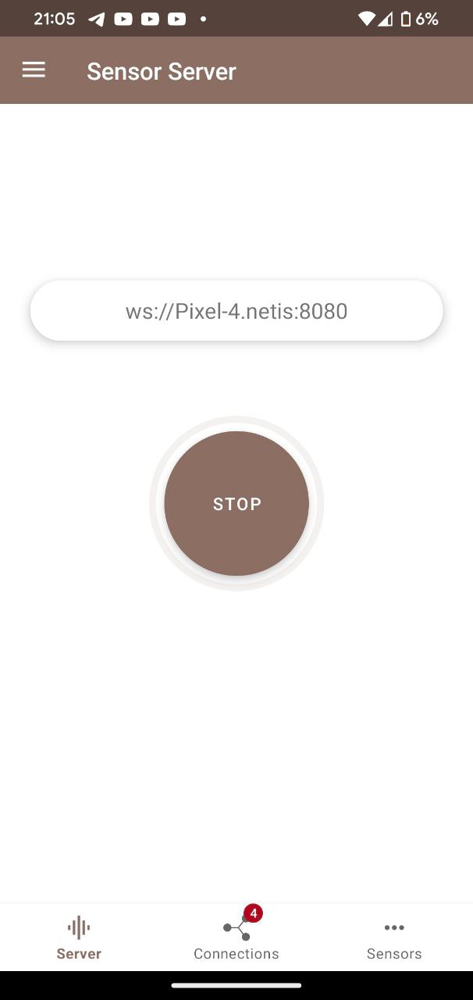

# Lab 4 Virtual Reality.

Sensor fusion:
Use magnetometer, accelerometer and gyroscope to orientate in space.

Installed Server Start app on the phone:



Read data from the gyroscope, magnetometer and accelerometer on the phone by WebSocket:
```
const socket = new WebSocket('ws://Pixel-4.netis:8080/sensors/connect?types=["android.sensor.accelerometer", "android.sensor.magnetic_field", "android.sensor.gyroscope"]')
```
Use this data to construct modelview matrix using weights: 0.5 for gyroscope data and 0.5 for magnetometer and accelerometer:

```
function constructModelViewMatrix(rotationMatrixFromMagnetometerAndAccelerometer, matrixFromGyroscope) {
  var weightGyroscope = 0.5;
  var weightMagnetometerAndAccelerometer = 0.5;
  var resultModelView = new Float32Array(16);

  resultModelView.forEach((element, index) => resultModelView[index] = weightGyroscope * matrixFromGyroscope[index] + weightMagnetometerAndAccelerometer * rotationMatrixFromMagnetometerAndAccelerometer[index]);

  return resultModelView;
}
```

GIF presenting lab:

